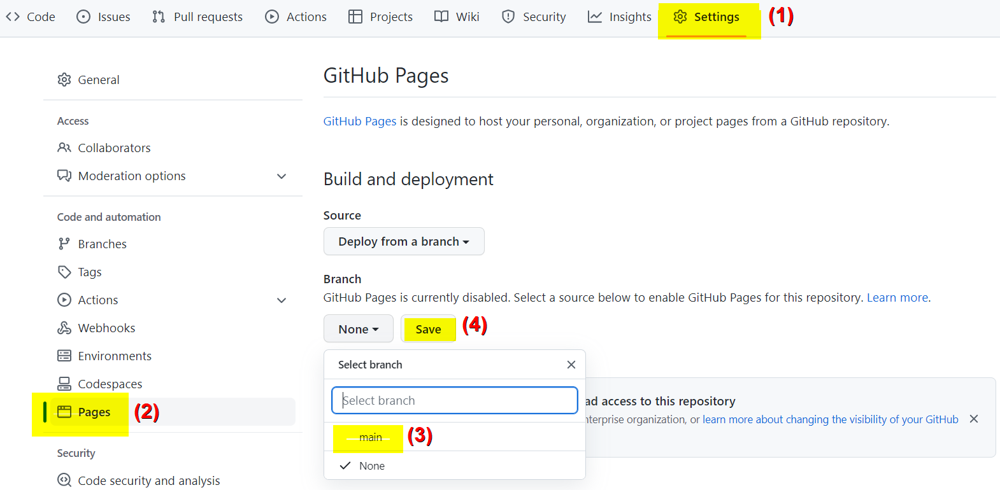

## Mes sites de SNT sur GitHub

Cette partie présente une démarche qui vous permettra de développer vos sites web avec l'éditeur Visual Studio Code de GitPod en ligne et de les héberger dans GitHub pour les publier hors de la KhanAcademy...

### Créer un dépot GitHub
Créer un compte sur GitHub (Sign up) depuis un navigateur à l'adresse [https://github.com/](https://github.com/){target="_blank"} :

<figure>
    
</figure>

Ou identifier vous (Sign in) si vous avez déjà un compte :

<figure>
    
</figure>

A l'adresse [https://github.com/new](https://github.com/new){target="_blank"} créer un nouveau répertoire de dépot nommé, par exemple `mon_premier_site` :

<figure>
    
</figure>

Cocher la case **"Initialize this repository with a README"** puis cliquer sur le bouton **"Create repository"**.

> Voilà, vous faites maintenant parti d'un autre [réseau social mondial celui des développeurs qui partage leur code](https://medium.com/coding-days/focus-sur-github-le-r%C3%A9seau-social-des-d%C3%A9veloppeurs-165a2978ea9e){target="_blank"}...


### Utiliser VSC en ligne pour gérer votre dépot GitHub depuis GitPod

#### Préparation de GitPod

Pour faire fonctionner l'[IDE](https://fr.wikipedia.org/wiki/Environnement_de_d%C3%A9veloppement){target=_blank} Visual Studio Code dans un navigateur et ainsi développer et maintenir des dépôts GitHub depuis n’importe quelle machine sans installation locale on peut utiliser [https://www.gitpod.io/](https://www.gitpod.io/){target=_blank} :

- **Signer** avec votre compte GitHub ;
- **Saisir** votre numéro de téléphone pour une double authentification ;
- **Choisir** VS Code BROWSER ;
- **Cliquer** sur `New Workspace` ;
- **Rechercher** puis **choisir** votre dépot dans la liste ou **copier/coller** son URL ;

> Tous les dossiers et fichiers de votre dépot sont alors éditables dans l'environnement de développement Visual Studio Code intégré à GitPod en ligne.

<figure>
    
</figure>

- **Accorder** toutes les autorisations de GitHub à GitPod en cliquant sur le logo de GitHub dans la barre de gauche...

#### Développement d'une page dans VSC

- Dans la zone de l'explorateur (_bleu_), **créer** un nouveau fichier (_jaune_) nommé `index.html` ;
- Dans la zone d'édition du fichier, **saisir** un `!` et **valider** la proposition _"Emmet Abbreviation"_ de VSC :
<code><pre>
&lt;!DOCTYPE html&gt;
&lt;html lang="en"&gt;
&lt;head&gt;
    &lt;meta charset="UTF-8"&gt;
    &lt;meta http-equiv="X-UA-Compatible" content="IE=edge"&gt;
    &lt;meta name="viewport" content="width=device-width, initial-scale=1.0"&gt;
    &lt;title&gt;Document&lt;/title&gt;
&lt;/head&gt;
&lt;body&gt;        
&lt;/body&gt;
&lt;/html&gt;
</code></pre>

- Dans le code ainsi obtenu, **remplacer** `"en"` par `"fr"` et **donner** un titre à la page d'accueil de votre futur site ;
- **Compléter** le `body` avec les balises de contenu que vous souhaitez voir s'afficher sur cette page ;
- Dans un terminal, **saisir** `python -m http.server`, puis **cliquer** sur le bouton `Open Browser` (ou sur port pour afficher votre page dans un nouvel onglet de votre navigateur ;
- **Compléter** le code HTML de votre page et **vérifier** le résultat obtenu en rafraichissant régulièrement l'affichage de cet onglet du navigateur ;

### Publier votre site sur GitHub

- Dans la zone GitHub, **vérifier** les autorisations accordés à GitPod par GitHub ;
- Dans la zone Source Control (_vert_), **cliquer** sur le `+` (_orange_) pour ajouter les fichiers modifiés à mettre en attente (à indexer) à ce stade du développement, **ajouter** un message (_rose_) avant de **commiter** (_violet_), puis **synchroniser** vos modifications ;

<figure>
    
</figure>

- **Paramétrer** GitHub pour qu'il affiche votre site Web : dans `Settings`, choisir `Pages` puis sélectionner la branche `main` et cliquer sur le bouton `Save` :

{.center width=80%}

- Enfin, après quelques minutes, dans un navigateur, rendez vous à une adresse telle que <https://username.github.io/nom-de-votre-site/>...


### ==La routine pour maintenir votre site Git avec un éditeur VSC en ligne se résume à :==

??? summary "I - Modifier vos fichiers sur la machine virtuelle GitPod :"
    {align=right width= 20%} Depuis l'Explorateur (`Explorer` ++"Ctrl"+"Maj"+"E"++) de VSC (_bleu_) :

    - cliquer sur un dossier pour afficher la liste de son contenu ;
    - cliquer sur les icônes (_jaunes_) pour créer un nouveau fichier et/ou un nouveau dossier ;
    - maintenir le clic (= clic droit) sur un fichier (ou un dossier) pour renommer son chemin et ainsi le déplacer dans l'arborescence ;
    - cliquer sur un fichier pour l'ouvrir dans l'éditeur afin de le modifier ;
    - maintenir le clic (= clic droit) sur un fichier `.md` et choisir `Open preview` pour le prévisualiser ;
    - démarrer un serveur `python -m http.server` depuis un terminal pour visualiser un fichier `.html`

??? summary "II - Indexer vos changements :"
    {align=right width= 20%}Depuis le "Contrôle de code source" (_vert_) (`Source Control` ++"Ctrl"+"Maj"+"G"++),
     dans "Changements" (`Changes`) cliquer sur le `+` (_orange_) pour ajouter les fichiers modifiés
      à mettre en attente (indexer) dans cette phase (stage) de développement ;

??? summary "III - Committer, valider vos modifications :"
    {align=right width= 20%}Ajouter un message sous "CONTRÔLE DE CODE SOURCE" (`SOURCE CONTROL`) (_rose_)
     pour définir ces modifications à ce stade de votre développement,
      puis cliquer sur `✓` (_violet_) pour valider ce commit ;

??? summary "IV - Pousser les modifications vers votre dépôt distant :"
    Cliquer sur les `...` en face de `CONTRÔLE DE CODE SOURCE`
    et choisir `Push` ;

    
<!-- ??? example "Exemple à faire vous même :"

    - **cliquer** sur l'icone `New Folder` (_jaune_) pour créer un nouveau dossier nommé `images` ;
    - **déplacer** votre fichier image dans le dossier `images` ;
    - **cliquer** sur le fichier `index.md` pour l'ouvrir dans l'éditeur ;
    - **cliquer**  droit le fichier `index.md`et choisir `Open preview` pour le prévisualiser ;
    - **glisser** l'onglet de la fenêtre de prévisualisation sur le coté droit ;
    - **modifier** le chemin relatif vers l'image dans l'instruction MarkDown `` ; 
    - **prévisualiser** pour vérifier le bon affichage de l'image ;
    - **indexer**, **Commiter** puis **Pousser** vos modifications ;
    - **vérifier** la mis à jour de votre dépôt ; -->

<figure>
    
</figure>


<!-- ## Modifier le fichier `README.md`

Le fichier `README` a pour extension `.md` pour [**MarkDown**](https://fr.wikipedia.org/wiki/Markdown){target="_blank"}, c'est ce langage de description rudimentaire que nous utiliserons principalement pour rédiger nos pages web sur GitHub.

> Il existe plusieurs versions de ce langage qui, à partir d'une syntaxe de base commune, possèdent d'autres éléments additionnels spécifiques...

**Cliquer** sur le crayon pour ouvrir le fichier `README.md`dans l'éditeur en ligne :

<figure>
    
</figure>

**Modifier** son contenu en utilisant la syntaxe [MarkDown à la sauce GitHub](https://guides.github.com/features/mastering-markdown/){target="_blank"} :

<figure>
    
</figure>


!!! tip "L'onglet `Preview` permet de visualiser le résultat avant sa publication..."

??? example "Code exemple à copier/coller"    
    ```md
    ## Voici un titre de niveau 2
    ### Et voici un titre de niveau 3
    Ceci est un paragraphe.
    Cette ligne s'affiche dans le même paragraphe à la suite de la première phrase sans retour à la ligne.  
    Cette ligne s'affiche dans le même paragraphe avec un retour à la ligne
    car on a laissé deux caractères espaces après le point de la phrase précédente.

    Cette ligne s'affiche dans un nouveau paragraphe
    car on a laissé deux sauts de ligne après le point de la phrase précédente.

    On peut obtenir du _texte_ avec *simple emphase* rendu en *italique*,
    du __texte__ avec **forte emphase** rendu en **Gras**,
    du **_Texte_** à la fois en **gras** et en *italique*,
    du `code source` rendu en caractères `monospaces`,
        du ~~texte barré~~  rendu avec une ligne en travers du texte.

    ## Un lien :
    Ce document est rédigé en [MarkDown](https://fr.wikipedia.org/wiki/Markdown).

    ## Une image :
    

    ## Une liste :
    - Toto ;
    - Titi ;
    - Tata...

    ## Un avertissement :
    > Libre à vous de personaliser cette page à l'aide de la documentation
    >  du [MarkDown à la sauce GitHub](https://docs.github.com/en/get-started/writing-on-github/getting-started-with-writing-and-formatting-on-github/basic-writing-and-formatting-syntax)...
    ```

**Publier** la nouvelle version du fichier `README.md` en décrivant vos modifications dans un message et puis en cliquant sur le bouton `Commit changes` :

<figure>
    
</figure>

> **Waouh !** vous venez de faire votre premier [**Commit**](https://fr.wikipedia.org/wiki/Commit){target="_blank"} **!**

## Créer de nouveaux dossier et fichier

**Cliquer** sur le bouton `Add file` depuis l'interface de votre dépot GitHub et choisir `Create new files` :

Dans l'éditeur qui s'ouvre, saisir le nom du fichier avec son extension et son chemin dans l'arborescence, par exemple `docs/index.md` :

<figure>
    
</figure>

<figure>
    <figcaption>
        Comment éditer une arborescence de dossiers sur GitHub ?        
    </figcaption>
    <iframe width="560" height="315" src="https://www.youtube-nocookie.com/embed/0a19JTSxclw" title="YouTube video player" frameborder="0" allow="accelerometer; autoplay; clipboard-write; encrypted-media; gyroscope; picture-in-picture" allowfullscreen>
    </iframe> 
</figure>


**Faire** un nouveau **Commit** avec le message : `ajout fichier index.md dans dossier docs`

## Téléverser des dossiers et fichiers

Depuis le dossier `docs`, **Cliquer** sur le bouton `Add file` depuis l'interface de votre dépot GitHub et choisir `Upload files` :

<figure>
    
</figure>

!!! tip "Partager votre écran pour Glisser/Déposer vos dossiers et/ou vos fichiers"

???+ example "Exemple à faire vous même :"    
    - **glisser/déposer** un fichier image dans le dossier `docs` ;
    - **Committer** ;
    - **Editer** le fichier `index.md` en y ajoutant l'instruction MarkDown `` ;
    - **Prévisualiser** pour vérifier le bon affichage de l'image ;
    - **Committer** ; -->