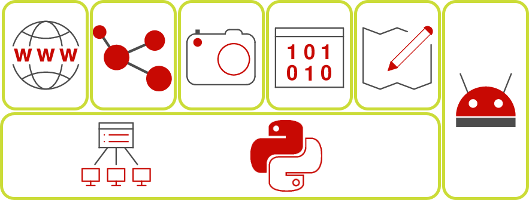

[{: align=left width=10%}](){target=_blank}[{: align=right width=10%}](mailto:team@ecmorlaix.fr){target=_blank}Ce site s'adresse aux secondes 2GT4 du lycée Notre Dame du Mur de MORLAIX pour l'enseignement des Sciences Numériques et Technologie.

{: .center width=40%}

<!-- 
### Autres liens du groupe :

- [Sharepoint](https://ecmorlaix.sharepoint.com/sites/TEAM-1NSI-20212022/Documents%20partages/Forms/AllItems.aspx?CT=1633088990185&RootFolder=%2Fsites%2FTEAM%2D1NSI%2D20212022%2FDocuments%20partages%2FGeneral&FolderCTID=0x012000019689D1FEC0FB4E86F4D05CA2B5A0EC){target=_blank}
- [Conversation](https://outlook.office365.com/mail/group/ecmorlaix.fr/team-tnsi-20222023/email){target=_blank} -->

## Programme

??? abstract "Le [programme](https://eduscol.education.fr/1670/programmes-et-ressources-en-sciences-numeriques-et-technologie-voie-gt){target=_blank} de SNT est articulé autour de sept thèmes:"

    === "Données structurées"
        {align=left}
        
        Les données constituent la matière première de toute activité numérique. Afin de permettre leur réutilisation, il est nécessaire de les conserver de manière persistante. Les structurer correctement garantit que l’on puisse les exploiter facilement pour produire de l’information.

        Comment traiter ces données ?
    === "Photo numérique"

        {align=left}
        
        Les technologies de la photographie argentique ont eu une évolution très lente, liée aux progrès en optique, mécanique et chimie. Ce n’est plus du tout le cas de l’évolution actuelle, davantage due aux algorithmes qu’à la physique : algorithmes de développement et d’amélioration de l’image brute, algorithmes d’aide à la prise de vue. La photographie numérique présente un coût marginal très faible et une diffusion par internet facile et immédiate : chaque jour, des milliards de photos sont prises et partagées.

        Comment sont représentées ces images sur un ordinateur et comment les traiter pour les modifier ?

    === "Internet"
        {align=left}

        Grâce à sa souplesse et à son universalité, Internet est devenu le moyen de communication principal entre les hommes et avec les machines.

        Quels sont les techniques et protocoles qui permettent la circulation des informations sur ce réseau mondial ?
    === "Web"
        {align=left}

        Le Web (toile) désigne un système donnant accès à un ensemble de données (page, image, son, vidéo) reliées par des liens hypertextes et accessibles sur le réseau Internet.

        Comment sont construites les pages Web et comment communiquer avec un serveur ?

    === "Réseaux sociaux"
        {align=left}

        Les réseaux sociaux sont des applications basées sur les technologies du Web qui offrent un service de mise en relation d’internautes pour ainsi développer des communautés d’intérêts.

        Comment ces réseaux gèrent les données des utilisateurs et comment mettent-ils en place les services de recommandation/suggestion ?
    === "Localisation /cartographie"
        {align=left}

        La cartographie est essentielle pour beaucoup d’activités : agriculture, urbanisme, transports, loisirs, etc. Elle a été révolutionnée par l’arrivée des cartes numériques accessibles depuis les ordinateurs, tablettes et téléphones, bien plus souples à l’usage que les cartes papier.

        Comment se repérer sur ces cartes et comment calculer un itinéraire ?

    === "Objets connectés"
        {align=left}
        Embarquer l’informatique dans les objets a beaucoup d’avantages : simplifier leur fonctionnement, leur donner plus de possibilités d’usage et de sûreté, et leur permettre d’intégrer de nouvelles possibilités à matériel constant par simple modification de leur logiciel.

        Comment réaliser un programme simple à embarquer dans un objet ?

??? tip "Progression envisagée :"

    {.center}

    - Le thème de l'informatique embarquée et des objets connectés (IOT : internet of things) étant également abordé au cours de l'année par certains en enseignement de Sciences de l'Ingénieur, ils nous en présenteront une synthèse à la fin.

    - L'initiation à la programmation en Python et Internet seront traités transversalement aux autres thèmes au fil de l'eau.

??? warning "Evolution de l’enseignement SNT :"

    Nous tâcherons de suivre la première recommandation d'évolution de l’enseignement SNT publiée en juin 2022 par le Conseil Supérieur des Programmes (CSP) et soutenue par la Société Informatique de France (SIF) qui consiste à faire évoluer le contenu de cet enseignement de seconde vers un enseignement d’informatique et numérique en lien direct avec les besoins de formation du citoyen et du scientifique du XXIe siècle.

    > "En effet, cet enseignement se doit de répondre à plusieurs enjeux essentiels et complémentaires : donner un socle de connaissances et compétences fondamentales nécessaire à tout citoyen du XXIe siècle, contribuer à construire le bagage des informaticiens en devenir, transmettre aux jeunes des premières clés scientifiques et techniques pour être en capacité d’inventer les futurs usages du numérique dans les nombreuses disciplines et métiers qu’il transforme, et enfin les éclairer dans leurs choix d’orientation.
    >
    > En particulier, cet enseignement devrait être l’occasion de montrer l’informatique dans sa diversité en transmettant des éléments essentiels issus des 4 piliers de cette science et technique : algorithmes, langages, données, machines. Le recours à des thèmes concrets proches des usages des jeunes pour illustrer les différents concepts mérite d’être conservé à condition d’être, cette fois, assujetti à de réelles ambitions en matière d’acquisition de compétences et connaissances fondamentales en informatique." (extraits du [COMMUNIQUE DE LA SIF POUR UNE EVOLUTION DE L'ENSEIGNEMENT SNT](https://www.societe-informatique-de-france.fr/wp-content/uploads/2022/07/Communique_SIF_sur_SNT.pdf){target=_blank})
    
    {.center}

    > Je tâcherai donc de vous accompagner, autant que possible, dans votre apprentissage de **l'informatique, la "vrai"** !

## Cahier de texte

***

{: .center width=50%}

[mail]: mailto:eric.madec@ecmorlaix.fr "eric.madec@ecmorlaix.fr"

***
### Le 06/09

=== "Activités en classe"

    - Accueil -> ==**remplir** une fiche d'informations== ;
    - [Présentation de la matière](#programme) ;
    - Visionnage de "Petite histoire de l'informatique" une vidéo réalisée par l'[INRIA](https://www.inria.fr/fr){:target="_blank"} -> ==**relever** les noms propres, dates clefs, mots et acronymes liés à l'informatique== :

    <figure>
        <iframe width="560" height="315" src="https://www.youtube-nocookie.com/embed/16udHcMYRFA" title="YouTube video player" frameborder="0" allow="accelerometer; autoplay; clipboard-write; encrypted-media; gyroscope; picture-in-picture" allowfullscreen></iframe>
    </figure>

    > [La playlist comprenant 5 vidéos](https://www.youtube.com/playlist?list=PLWvGMqXvyJAMj8f57Hnk3U7oZP8Gi7OyR)
<!-- 
=== "A faire à la maison"

    - **Revoir** la [vidéo](https://www.youtube.com/playlist?list=PLWvGMqXvyJAMj8f57Hnk3U7oZP8Gi7OyR){:target="_blank"} et **lire** le [livret d'accompagnement](./pdf/livret-histoire_informatique_INRIA.pdf){:target="_blank"} -->
