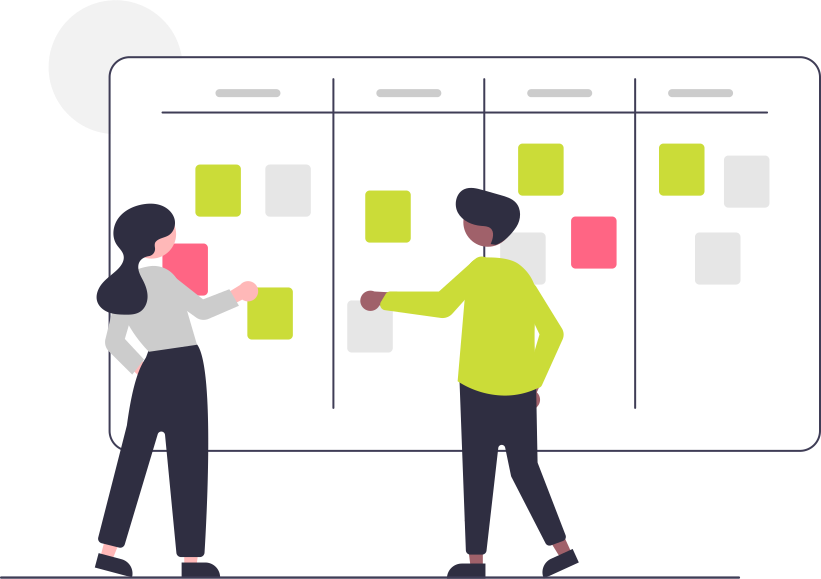

[{: align=left width=10%}](){target=_blank}[{: align=right width=10%}](mailto:team@ecmorlaix.fr){target=_blank}Ce site s'adresse aux secondes 2GT4 du lycée Notre Dame du Mur de MORLAIX pour l'enseignement des Sciences Numériques et Technologie.

{: .center width=40%}

<!-- 
### Autres liens du groupe :

- [Sharepoint](https://ecmorlaix.sharepoint.com/sites/TEAM-1NSI-20212022/Documents%20partages/Forms/AllItems.aspx?CT=1633088990185&RootFolder=%2Fsites%2FTEAM%2D1NSI%2D20212022%2FDocuments%20partages%2FGeneral&FolderCTID=0x012000019689D1FEC0FB4E86F4D05CA2B5A0EC){target=_blank}
- [Conversation](https://outlook.office365.com/mail/group/ecmorlaix.fr/team-tnsi-20222023/email){target=_blank} -->

## Programme

??? abstract "Le [programme](https://eduscol.education.fr/1670/programmes-et-ressources-en-sciences-numeriques-et-technologie-voie-gt){target=_blank} de SNT est articulé autour de sept thèmes:"

    === "Données structurées"
        {align=left}
        
        Les données constituent la matière première de toute activité numérique. Afin de permettre leur réutilisation, il est nécessaire de les conserver de manière persistante. Les structurer correctement garantit que l’on puisse les exploiter facilement pour produire de l’information.

        Comment traiter ces données ?
    === "Photo numérique"

        {align=left}
        
        Les technologies de la photographie argentique ont eu une évolution très lente, liée aux progrès en optique, mécanique et chimie. Ce n’est plus du tout le cas de l’évolution actuelle, davantage due aux algorithmes qu’à la physique : algorithmes de développement et d’amélioration de l’image brute, algorithmes d’aide à la prise de vue. La photographie numérique présente un coût marginal très faible et une diffusion par internet facile et immédiate : chaque jour, des milliards de photos sont prises et partagées.

        Comment sont représentées ces images sur un ordinateur et comment les traiter pour les modifier ?

    === "Internet"
        {align=left}

        Grâce à sa souplesse et à son universalité, Internet est devenu le moyen de communication principal entre les hommes et avec les machines.

        Quels sont les techniques et protocoles qui permettent la circulation des informations sur ce réseau mondial ?
    === "Web"
        {align=left}

        Le Web (toile) désigne un système donnant accès à un ensemble de données (page, image, son, vidéo) reliées par des liens hypertextes et accessibles sur le réseau Internet.

        Comment sont construites les pages Web et comment communiquer avec un serveur ?

    === "Réseaux sociaux"
        {align=left}

        Les réseaux sociaux sont des applications basées sur les technologies du Web qui offrent un service de mise en relation d’internautes pour ainsi développer des communautés d’intérêts.

        Comment ces réseaux gèrent les données des utilisateurs et comment mettent-ils en place les services de recommandation/suggestion ?
    === "Localisation /cartographie"
        {align=left}

        La cartographie est essentielle pour beaucoup d’activités : agriculture, urbanisme, transports, loisirs, etc. Elle a été révolutionnée par l’arrivée des cartes numériques accessibles depuis les ordinateurs, tablettes et téléphones, bien plus souples à l’usage que les cartes papier.

        Comment se repérer sur ces cartes et comment calculer un itinéraire ?

    === "Objets connectés"
        {align=left}
        Embarquer l’informatique dans les objets a beaucoup d’avantages : simplifier leur fonctionnement, leur donner plus de possibilités d’usage et de sûreté, et leur permettre d’intégrer de nouvelles possibilités à matériel constant par simple modification de leur logiciel.

        Comment réaliser un programme simple à embarquer dans un objet ?

??? tip "Progression envisagée :"

    {.center}

    - Le thème de l'informatique embarquée et des objets connectés (IOT : internet of things) étant également abordé au cours de l'année par certains en enseignement de Sciences de l'Ingénieur, ils nous en présenteront une synthèse à la fin.

    - L'initiation à la programmation en Python et Internet seront traités transversalement aux autres thèmes au fil de l'eau.

??? warning "Evolution de l’enseignement SNT :"

    Nous tâcherons de suivre la première recommandation d'évolution de l’enseignement SNT publiée en juin 2022 par le Conseil Supérieur des Programmes (CSP) et soutenue par la Société Informatique de France (SIF) qui consiste à faire évoluer le contenu de cet enseignement de seconde **vers un enseignement d’informatique et numérique en lien direct avec les besoins de formation du citoyen et du scientifique du XXIe siècle**.

    > _"En effet, cet enseignement se doit de répondre à plusieurs enjeux essentiels et complémentaires : donner un socle de connaissances et compétences fondamentales nécessaire à tout citoyen du XXIe siècle, contribuer à construire le bagage des informaticiens en devenir, transmettre aux jeunes des premières clés scientifiques et techniques pour être en capacité d’inventer les futurs usages du numérique dans les nombreuses disciplines et métiers qu’il transforme, et enfin les éclairer dans leurs choix d’orientation."_
    >
    > _"En particulier, cet enseignement devrait être l’occasion de montrer l’informatique dans sa diversité en transmettant des éléments essentiels issus des 4 piliers de cette science et technique : algorithmes, langages, données, machines. Le recours à des thèmes concrets proches des usages des jeunes pour illustrer les différents concepts mérite d’être conservé à condition d’être, cette fois, assujetti à de réelles ambitions en matière d’acquisition de compétences et connaissances fondamentales en informatique."_ (extraits du [COMMUNIQUE DE LA SIF POUR UNE EVOLUTION DE L'ENSEIGNEMENT SNT](https://www.societe-informatique-de-france.fr/wp-content/uploads/2022/07/Communique_SIF_sur_SNT.pdf){target=_blank})
    
    {.center}

    > Je tâcherai donc de vous accompagner, autant que possible, dans votre apprentissage de **l'informatique, la "vrai"** !

## Cahier de texte

***

{: .center width=50%}

[mail]: mailto:eric.madec@ecmorlaix.fr "eric.madec@ecmorlaix.fr"

***
### Le 10/01

=== "CONTENU DE SÉANCE"
    
    - Poursuite du thème les réseaux sociaux :

        - Finaliser vos [recherches](https://ericecmorlaix.github.io/SNT-2GT4_2022-2023/RS/#recherches) concernant le réseau social tiré au sort dans la liste en résumant les données collectées dans une `note.md` d'Obsidian : ==**Vérifier** l'ensemble des items à traiter== ;
        - Préparer un [diaporama dans Obsidian](https://ericecmorlaix.github.io/SNT-2GT4_2022-2023/RS/#presentation) support de votre présentation orale et produire une vidéo partagée sur Stream d'Office365...
        - Mesurer vos compétences dans le domaine des réseaux sociaux en suivant [le parcours `ZRSJAG289` sur PIX](https://app.pix.fr/campagnes/ZRSJAG289){target="_blank"} ;
        - => ==Transmettre par mail un dossier archive (compressé, zip) contenant votre `note.md`, votre `diaporama.md`, tous les fichiers d'images et d'autres éléments intégrés...) ;

    - Synthèse programmation en Python de [https://py-rates.fr/](https://py-rates.fr/){target="_blank"} ;
   
        
=== "TRAVAIL À FAIRE"

    - Lire le chapitre concernant les réseaux sociaux sur [www.lelivrescolaire.fr](https://www.lelivrescolaire.fr/page/30674519) ;
    - Explorer les fonctionnalités du logiciel [Obsidian](https://ericecmorlaix.github.io/adn-Tutoriel_Obsidian/){target="_blank"} pour améliorer votre diaporama ;
    - Finir tous les niveaux de [https://py-rates.fr/](https://py-rates.fr/){target="_blank"}
    - [S'entrainer à Algoréa](https://algorea.org/#/preparation){target="_blank"}

***
### Le 10/01

=== "CONTENU DE SÉANCE"
    
    - Poursuite du thème les réseaux sociaux :

        - Finaliser vos [recherches](https://ericecmorlaix.github.io/SNT-2GT4_2022-2023/RS/#recherches) concernant le réseau social tiré au sort dans la liste en résumant les données collectées dans une note d'Obsidian : ==**Vérifier** l'ensemble des items à traiter== ;
        - Préparer un [diaporama dans Obsidian](https://ericecmorlaix.github.io/SNT-2GT4_2022-2023/RS/#presentation) support de votre présentation orale et produire une vidéo partagée sur Stream d'Office365...
        - Mesurer vos compétences dans le domaine des réseaux sociaux en suivant [le parcours `ZRSJAG289` sur PIX](https://app.pix.fr/campagnes/ZRSJAG289){target="_blank"} ;  
   
        
=== "TRAVAIL À FAIRE"

    - Lire le chapitre concernant les réseaux sociaux sur [www.lelivrescolaire.fr](https://www.lelivrescolaire.fr/page/30674519) ;
    - Explorer les fonctionnalités du logiciel [Obsidian](https://ericecmorlaix.github.io/adn-Tutoriel_Obsidian/){target="_blank"} pour améliorer votre diaporama ;
    - Finir tous les niveaux de [https://py-rates.fr/](https://py-rates.fr/){target="_blank"}
    - [S'entrainer à Algoréa](https://algorea.org/#/preparation){target="_blank"}

***
### Le 13/12

=== "CONTENU DE SÉANCE"
    
    - Remédiation technique sur les envois par mail des fichiers `note.md` avec images en PJ ;

    - Poursuite du thème les réseaux sociaux :

        - Finaliser vos [recherches](https://ericecmorlaix.github.io/SNT-2GT4_2022-2023/RS/#recherches) concernant le réseau social tiré au sort dans la liste en résumant les données collectées dans une note d'Obsidian ;
        - Préparer un [diaporama dans Obsidian](https://ericecmorlaix.github.io/SNT-2GT4_2022-2023/RS/#presentation) support de votre présentation orale et le publier sur le web via GitHub...  
   
        
=== "TRAVAIL À FAIRE"

    - Lire le chapitre concernant les réseaux sociaux sur [www.lelivrescolaire.fr](https://www.lelivrescolaire.fr/page/30674519) ;
    - Explorer les fonctionnalités du logiciel [Obsidian](https://ericecmorlaix.github.io/adn-Tutoriel_Obsidian/){target="_blank"} pour améliorer votre diaporama ;
    - Finir tous les niveaux de [https://py-rates.fr/](https://py-rates.fr/){target="_blank"}
    - [S'entrainer à Algoréa](https://algorea.org/#/preparation){target="_blank"}
    
***
### Le 06/12

=== "CONTENU DE SÉANCE"
    
    - Découverte du logiciel [Obsidian](https://ericecmorlaix.github.io/adn-Tutoriel_Obsidian/){target="_blank"} -> ==récupération dans un coffre d'iCloud du fichier MarkDown de la [liste de réseaux sociaux](https://codimd.apps.education.fr/dgUvKX8xQJG0PYrV2CBp_Q){target="_blank"} mise à jour== ;

    - Poursuite du thème les réseaux sociaux -> ==Faire des recherches concernant le réseau social tiré au sort dans la liste et les résumer dans une note d'Obsidian== ;   
    
        
=== "TRAVAIL À FAIRE"

    - Lire le chapitre concernant les réseaux sociaux sur [www.lelivrescolaire.fr](https://www.lelivrescolaire.fr/page/30674519) ;
    - Explorer les fonctionnalités du logiciel [Obsidian](https://ericecmorlaix.github.io/adn-Tutoriel_Obsidian/){target="_blank"} ;
    
***
### Le 29/11

=== "CONTENU DE SÉANCE"
    
    - Synthèse du thème Web et bilan du trimestre ;

    - Initiation du thème les réseaux sociaux -> ==rédaction collective en MarkDown d'une [liste de réseaux sociaux](https://codimd.apps.education.fr/dgUvKX8xQJG0PYrV2CBp_Q){target="_blank"}== ;

    - Découverte du logiciel [Obsidian](https://ericecmorlaix.github.io/adn-Tutoriel_Obsidian/){target="_blank"} -> ==récupération dans un coffre d'iCloud du fichier MarkDown de la [liste de réseaux sociaux](https://codimd.apps.education.fr/dgUvKX8xQJG0PYrV2CBp_Q){target="_blank"} établie== ;   
    
        
=== "TRAVAIL À FAIRE"

    - Lire le chapitre concernant les réseaux sociaux sur [www.lelivrescolaire.fr](https://www.lelivrescolaire.fr/page/30674519) ;
    - Explorer les fonctionnalités du logiciel [Obsidian](https://ericecmorlaix.github.io/adn-Tutoriel_Obsidian/){target="_blank"} ;
    
***
### Le 22/11

=== "CONTENU DE SÉANCE"
    
    - Evaluation finale du thème Web par QCM ;

    - **Partager** par [mail] l'URL de votre site web publier depuis [GitHub](./github) -> ==**Résoudre** toutes les difficultés techniques restantes...== ;

    - A partir des [sujets à aborder en projet Web](./Web/#sujets-a-aborder-en-projet-web){:target="_blank"}, par équipe, développer chacun un site contenant le même contenu mais présenté dans des styles différents et avec des liens renvoyant vers un des autres sites de l'équipe ;
    
    > Entres autres, utiliser la ressource [www.lelivrescolaire.fr](https://www.lelivrescolaire.fr/page/30327051).
   
    - **Poursuivre** votre [initiation aux langages HTML/CSS pour faire une page web](https://fr.khanacademy.org/computing/computer-programming/html-css){:target="_blank"} ;
        
=== "TRAVAIL À FAIRE"

    - **Poursuivre** votre [initiation aux langages HTML/CSS pour faire une page web](https://fr.khanacademy.org/computing/computer-programming/html-css){:target="_blank"} ;
    - **Finir** votre projet Web ;
    
***
### Les 08 et 15/11

=== "CONTENU DE SÉANCE"
    
    - **Partager** par [mail] l'URL de votre site web publier depuis [GitHub](./github) -> ==**Résoudre** toutes les difficultés techniques restantes...== ;

    - A partir des [sujets à aborder en projet Web](./Web/#sujets-a-aborder-en-projet-web){:target="_blank"}, par équipe, développer chacun un site contenant le même contenu mais présenté dans des styles différents et avec des liens renvoyant vers un des autres sites de l'équipe ;
    
    > Entres autres, utiliser la ressource [www.lelivrescolaire.fr](https://www.lelivrescolaire.fr/page/30327051).
   
    - **Poursuivre** votre [initiation aux langages HTML/CSS pour faire une page web](https://fr.khanacademy.org/computing/computer-programming/html-css){:target="_blank"} ;
        
=== "TRAVAIL À FAIRE"

    - **Poursuivre** votre [initiation aux langages HTML/CSS pour faire une page web](https://fr.khanacademy.org/computing/computer-programming/html-css){:target="_blank"} ;
    - **Développer** votre projet Web ;
    
***
### Le 18/10

=== "CONTENU DE SÉANCE"
    
    - **Partager** par [mail] l'URL de votre site web publier depuis [GitHub](./github) -> ==**Résoudre** toutes les difficultés techniques restantes...== ;

    - A partir des [sujets à aborder en projet Web](./Web/#sujets-a-aborder-en-projet-web){:target="_blank"}, par équipe, développer chacun un site contenant le même contenu mais présenté dans des styles différents et avec des liens renvoyant vers un des autres sites de l'équipe ;
   
    - **Poursuivre** votre [initiation aux langages HTML/CSS pour faire une page web](https://fr.khanacademy.org/computing/computer-programming/html-css){:target="_blank"} ;
        
=== "TRAVAIL À FAIRE"

    - **Poursuivre** votre [initiation aux langages HTML/CSS pour faire une page web](https://fr.khanacademy.org/computing/computer-programming/html-css){:target="_blank"} ;
    - **Développer** votre projet Web ;
    
***
### Le 11/10

=== "CONTENU DE SÉANCE"
    
    - **Partager** par [mail] l'URL de votre site web publier depuis [GitHub](./github) ;

    - En binôme, choisir un des [sujets à aborder en projet Web](./Web/#sujets-a-aborder-en-projet-web){:target="_blank"} et développer deux sites contenant chacun le même contenu mais présenté dans des styles différents ;
   
    - **Poursuivre** votre [initiation aux langages HTML/CSS pour faire une page web](https://fr.khanacademy.org/computing/computer-programming/html-css){:target="_blank"} ;
        
=== "TRAVAIL À FAIRE"

    - **Poursuivre** votre [initiation aux langages HTML/CSS pour faire une page web](https://fr.khanacademy.org/computing/computer-programming/html-css){:target="_blank"} ;
    - **Développer** votre projet Web ;
***
### Le 04/10

=== "CONTENU DE SÉANCE"
    
    - Publier un site web depuis [GitHub](./github)
   
    - Poursuivre votre [initiation aux langages HTML/CSS pour faire une page web](https://fr.khanacademy.org/computing/computer-programming/html-css){:target="_blank"} ;
        
=== "TRAVAIL À FAIRE"

    - Poursuivre votre [initiation aux langages HTML/CSS pour faire une page web](https://fr.khanacademy.org/computing/computer-programming/html-css){:target="_blank"}
***
### Le 27/09

=== "CONTENU DE SÉANCE"
    
    - Présentation des [Notebook Jupyter](./notebook) et de l'application [Carnets](https://holzschu.github.io/Carnets_Jupyter/) => ==**créer** un nouveau bloc note pour conserver progressivement une trace de vos apprentissages HTML/CSS sur votre iPad.==       
   
    - Poursuivre votre [initiation aux langages HTML/CSS pour faire une page web](https://fr.khanacademy.org/computing/computer-programming/html-css){:target="_blank"} :
        - Pour le **_Défi : votre liste d'apprentissage_** => ==**lister** les noms propres, dates clefs, mots et acronymes liés à l'informatique que vous aviez relevé lors de visionnage de la [vidéo](https://www.youtube.com/playlist?list=PLWvGMqXvyJAMj8f57Hnk3U7oZP8Gi7OyR){:target="_blank"} et/ou de celles d'[Introduction au web](./Web/#introduction-au-web).==

        - Pour le **_Projet : site de voyage_**  => ==**choisir** un des sujets lié au web==

=== "TRAVAIL À FAIRE"

    - Poursuivre votre [initiation aux langages HTML/CSS pour faire une page web](https://fr.khanacademy.org/computing/computer-programming/html-css){:target="_blank"}
***
### Le 20/09

=== "CONTENU DE SÉANCE"

    - ["85 % des emplois de 2030 n’existent pas encore. En revanche on sait que l’essentiel de ces emplois concerneront le digital"](http://si.lycee.ecmorlaix.fr/nsi){target=_blank}
       
    - [Introduction au Web](./Web/#introduction-au-web) -> ==Synthèse des prises de notes avec l'iPad, vérification de [compétences](./competences_SNT) quant à l'envoi de [mail]==

    - Rejoindre la classe sur <https://fr.khanacademy.org/join/SZ58TC6N>{:target="_blank"} et commencer les activités de <https://fr.khanacademy.org/computing/computer-programming/html-css>{:target="_blank"}...

=== "TRAVAIL À FAIRE"

    - Poursuivre votre [initiation aux langages HTML/CSS pour faire une page web](https://fr.khanacademy.org/computing/computer-programming/html-css){:target="_blank"}

### Le 13/09

=== "CONTENU DE SÉANCE"

    ???+ question "Test formatif"
        !!! question ""
            === "Question 1"

                Citer les 4 piliers principaux de l'informatique ?

            === "Réponse"
                - Algorithme
                - Programme
                - Donnée
                - Machine
        
        !!! question ""
            === "Question 2"

                Nommer au moins 4 pionniers de l'informatique ?

            === "Réponse"
                - Abou Jafar Al khawarizmi 
                - Ada Lovelace
                - Alan Turing
                - Grace Hopper
   
    - Prise en main de la tablette -> ==Vérification des premières [compétences utiles en SNT](./competences_SNT)==

    - [Introduction au Web](./Web/#introduction-au-web) -> ==Faire une prise de notes avec l'iPad, la partager pour collaborer et la transmettre par [mail]==
    
=== "TRAVAIL À FAIRE"

    - **Revoir** des vidéos d'[Introduction au Web](./Web/#introduction-au-web), finir votre prise de notes avec l'iPad, et la transmettre finalement par [mail].

***

### Le 06/09

=== "CONTENU DE SÉANCE"

    - Accueil -> ==**remplir** une fiche d'informations== ;
    - [Présentation de la matière](#programme) ;
    - Visionnage de "Petite histoire de l'informatique" une vidéo réalisée par l'[INRIA](https://www.inria.fr/fr){:target="_blank"} -> ==**relever** les noms propres, dates clefs, mots et acronymes liés à l'informatique== :

    <figure>
        <iframe width="560" height="315" src="https://www.youtube-nocookie.com/embed/16udHcMYRFA" title="YouTube video player" frameborder="0" allow="accelerometer; autoplay; clipboard-write; encrypted-media; gyroscope; picture-in-picture" allowfullscreen></iframe>
    </figure>

    > [La playlist comprenant 5 vidéos](https://www.youtube.com/playlist?list=PLWvGMqXvyJAMj8f57Hnk3U7oZP8Gi7OyR)

=== "TRAVAIL À FAIRE"

    - **Revoir** la [vidéo](https://www.youtube.com/playlist?list=PLWvGMqXvyJAMj8f57Hnk3U7oZP8Gi7OyR){:target="_blank"} et **lire** le [livret d'accompagnement](./pdf/livret-histoire_informatique_INRIA.pdf){:target="_blank"}
